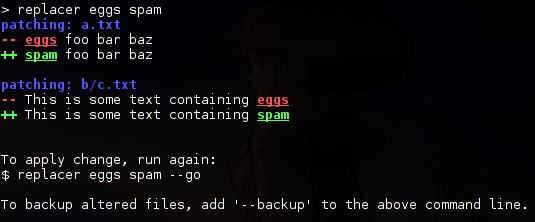

# replacer

[](https://pypi.python.org/pypi/replacer)

Replace text in files.

## Requirements


Python 2.7 or Python 3.

## Screenshot



## Basic usage

```bash
    replacer [OPTIONS] PATTERN REPLACEMENT [FILES ...]
```
Note that internally, we'll call Python with
```python
    re.sub(<PATTERN>, <REPLACEMENT>, line)
```
for each line of every regular file found in the current working directory.

This means you can use fancy backward references with `\1`

* By default hidden files, and files matching
  `build-*, .git, .svn, *.py[co], *.[oa] , *.back, *~ , *.so, *.a`
  will be ignored

* If `FILES` is given, replacement will be performed on the files given
  as argument.

* You can also specify `--file-filter` to specify a pattern to match against
  the filenames. For instance, to replace in every `.c` file, use:
  ```bash
  replacer spam eggs --file-filter '*.c'
  ```

* You can create a backup for each modified file by using `--backup`

## Advanced usage

See :
```bash
replacer --help
```
for a full list of options


## History

First version was implemented in Perl/Bash in
[ctafconf](https://github.com/cgestes/ctafconf/blob/78b92a60bc185b73f95418e3e913e33aae8799f6/bin/replacer)

Then it was rewritten in Python in this
[commit](https://github.com/cgestes/ctafconf/commit/73ea7320a593c1c31125ecff23c86b073f87ea26)
