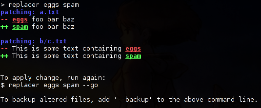

replacer
========

.. image:: http://img.shields.io/pypi/v/replacer.png
  :target: https://pypi.python.org/pypi/replacer

Replace text in files.

Requirements
-------------

Python 2.7 or Python 3.

Install
-------

Install with ``pip`` as usual.

Or, use the `AUR <https://aur.archlinux.org/packages/replacer/>`_
on Arch Linux.

Screenshot
----------

Basic usage
-----------

.. code-block::

    replacer [OPTIONS] PATTERN REPLACEMENT [FILES ...]

Note that internally, we'll call Python with::

    re.sub(<PATTERN>, <REPLACEMENT>, line)

for each line of every regular file found in the current working directory.

This means you can use fancy backward references with `\\1`

* By default hidden files, and files matching
  ``build-*, .git, .svn, *.py[co], *.[oa] , *.back, *~ , *.so, *.a``
  will be ignored

* If ``FILES`` is given, replacement will be performed on the files given
  as argument.

* You can also specify ``--file-filter`` to specify a pattern to match against
  the filenames. For instance, to replace in every `.c` file, use::

    replacer spam eggs --file-filter '*.c'

* You can create a backup for each modified file by using ``--backup``

Advanced usage
--------------

See ::

  replacer --help

for a full list of options

History
--------

First version was implemented in Bash in
`ctafconf <https://github.com/cgestes/ctafconf/blob/78b92a60bc185b73f95418e3e913e33aae8799f6/bin/replacer>`_.

Then it was rewritten in Python in this
`commit <https://github.com/cgestes/ctafconf/commit/73ea7320a593c1c31125ecff23c86b073f87ea26>`_.
